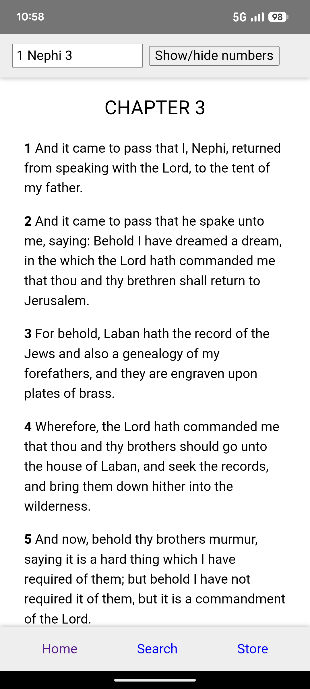
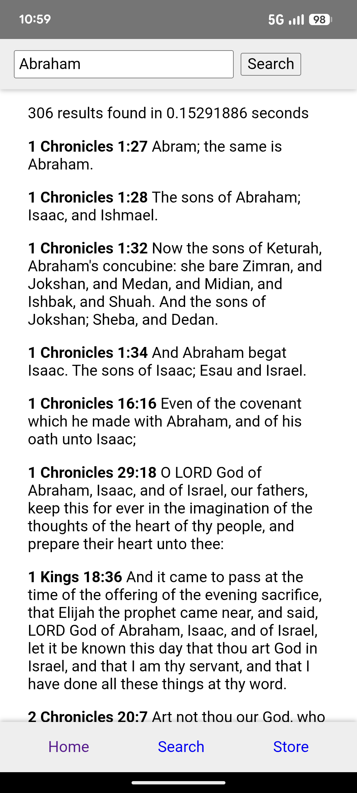

# Canon - Mobile App version

This is a cross-platform client for the Canon project, which is powered by [libcanon](https://github.com/pgattic/libcanon) for things like library management, searching, reference parsing, etc. It is fully written in Rust, using [Dioxus](https://dioxuslabs.com/) for the GUI.

Currently, it runs on both Desktop (Linux) and Android, with more platforms hopefully in the future.

## Screenshots

*Here you can see the scripture view, which is able to parse the reference typed into the bar.*

*Here you can see the search view, which is used to search your entire library of text for a given field. And just look at that search time!*

## Development Environment

In the process of developing this software, I used:

- Neovim (Code editor)
- Rust (Programming langauge)

## Useful Websites

### Rust

- [The Rust Book](https://doc.rust-lang.org/book/)
- [Dioxus Tutorial](https://dioxuslabs.com/learn/)

### Other

In creating this program, I wanted its usage syntax to be one that the most people would be familiar with, regardless of their background. Although it would be impossible to make it cover all potential shorthands for referencing text, here are some sources that I used for inspiration on the syntax of the references.

- [Bible Citation - Wikipedia](https://en.wikipedia.org/wiki/Bible_citation)
- [How to Cite the Bible - Messiah.edu](https://www.messiah.edu/download/downloads/id/1647/bible_cite.pdf)
- [The Quran: Word by Word](https://corpus.quran.com/wordbyword.jsp)
- [Preach My Gospel: Chapter 3, Lesson 4](https://www.churchofjesuschrist.org/study/manual/preach-my-gospel-2023/04-chapter-3/11-chapter-3-lesson-4?lang=eng)

